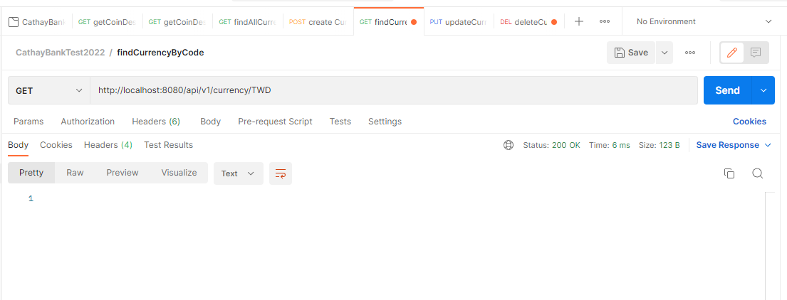

# cathayBankTest2022
Currency project for Cathay Bank Testing

## Environment
Database : H2

Framework : Spring Boot 2.7.0

Java version : 8

Maven

## API List
### API_01 : call coinDesk API to get coindesk data
URI : GET api/v1/coinDesk/CurrentPrice

### API_02 : call coinDesk API and regroup the return data
URI : GET api/v1/coinDesk/CurrentPrice/new

### API_03 : API for query CURRENCY dataTable
URL :

findAll : GET api/v1/currency

findByCode : GET api/v1/currency/**{code}**

### API_04 : API for create currency date into CURRENCY dataTable
URL : POST api/v1/currency

RequestBody: {name, code, description (optional)}

### API_05 : API for update currency dataTable
URL : PUT api/v1/currency/**{code}**

RequestBody: {name (optional), code (optional), description (optional)}

### API_06 : API for delete currency dataTable
URL : DELETE api/v1/currency/**{code}**

Searching after deleted

## Unit Testing Result
